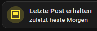
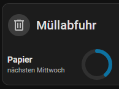

# Home Assistant Relative Date DE

A German relative date formatter for Home Assistant Jinja templates.

It converts date and datetime sensor states into natural German phrases such as:

- `heute`
- `gerade eben`
- `gestern Abend`
- `vorgestern Morgen`
- `morgen Nachmittag`
- `übermorgen Vormittag`
- `letzten Sonntag`
- `vorletzten Mittwoch`
- `in drei Wochen`
- `vor zwei Monaten`
- `in zwei Jahren`

The goal is to make date-based Home Assistant cards easier to read at a glance.

## Screenshots

### Example: mail



### Example: waste collection



## Features

The template supports:

- date-only states
- datetime states
- entities like: input_datetime, time, input_button (because it's state is last_pressed)
- input validation

For datetime values, the template can return phrases such as:

```text
gerade eben
heute Vormittag
heute Nacht
gestern Abend
morgen Mittag
übermorgen Nachmittag
```

For larger distances it switches to broader descriptions:

```text
letzten Sonntag
vorletzten Mittwoch
nächsten Freitag
übernächsten Montag
vor drei Wochen
in fünf Wochen
vor zwei Monaten
in acht Monaten
vor zwei Jahren
in drei Jahren
```

## Installation

### HACS

This repository can be installed as a HACS template repository.
In HACS:
1. Open HACS.
2. Open the menu.
3. Select Custom repositories.
4. Add this repository URL.
5. Select Template as the repository type.
6. Install the repository.

After installation, reload Home Assistant custom templates:
action: homeassistant.reload_custom_templates

You can run this from:
Settings → Developer Tools → Actions

A full Home Assistant restart is normally not required.

### Manual installation
Copy:
```text
uebermorgen.jinja
```
to:
```text
/config/custom_templates/uebermorgen.jinja
```
Then reload custom templates:
action: homeassistant.reload_custom_templates

## Usage
Import the macro in any Home Assistant template:
```text

{{ uebermorgen('sensor.example_date') }}
```

The argument must be an entity ID whose state contains a supported date or datetime.
#### Example:
```text

{{ uebermorgen('sensor.next_waste_collection') }}
```
Possible output:
nächsten Mittwoch

#### Mushroom Card example
```text
type: custom:mushroom-template-card
entity: sensor.next_waste_collection
primary: Papier
secondary: >
  
  {{ uebermorgen('sensor.next_waste_collection') }}
icon: mdi:trash-can-outline
```
#### Another example:
```text
type: custom:mushroom-template-card
entity: sensor.last_mail_received
primary: Letzte Post erhalten
secondary: >
  
  {{ uebermorgen('sensor.last_mail_received') }}
icon: mdi:mail
```

#### Supported input formats
Supported date values include:
2026-09-26

Supported datetime values include:
2026-09-26T08:30
2026-09-26T08:30:00
2026-09-26T08:30:00.123
2026-09-26 08:30
2026-09-26 08:30:00
2026-09-26T08:30:00+02:00
2026-09-26T06:30:00Z

## Relative date rules

### Near dates

| Distance | Example output |
|---|---|
| -2 days | `vorgestern` |
| -1 day | `gestern` |
| today | `heute` |
| +1 day | `morgen` |
| +2 days | `übermorgen` |

If the value contains a time, a time-of-day description is added.

### Time of day

| Time | Output |
|---|---|
| last 10 minutes | `gerade eben` |
| before 10:00 | `Morgen` |
| before 12:00 | `Vormittag` |
| before 14:30 | `Mittag` |
| before 17:00 | `Nachmittag` |
| before 22:00 | `Abend` |
| 22:00 or later | `Nacht` |

## Developer Info

### Testing
Install dependencies:
```text
python -m pip install -r requirements-dev.txt
```
Run all tests:
```text
python -m pytest -v
```